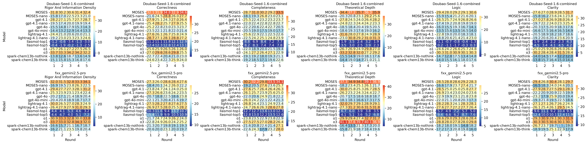
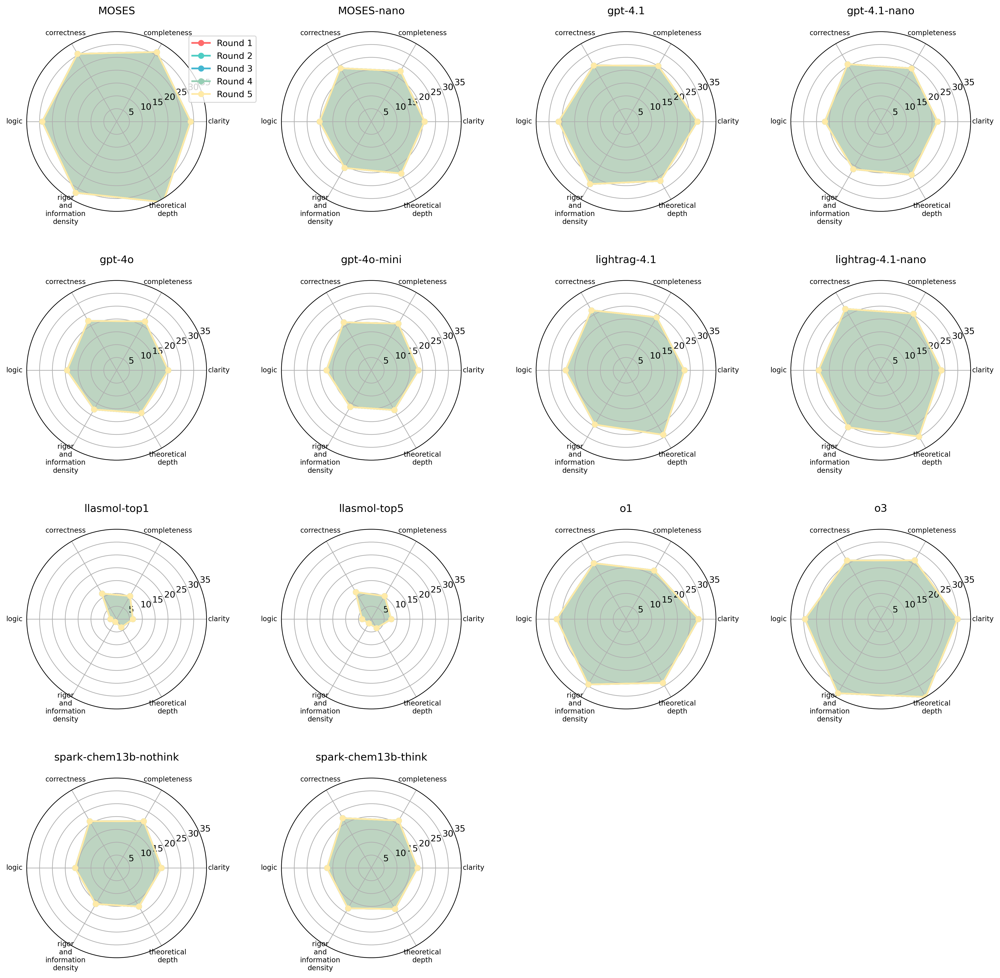
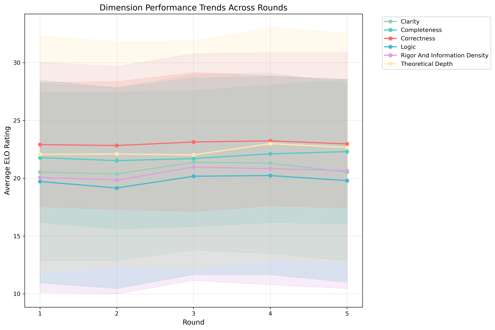
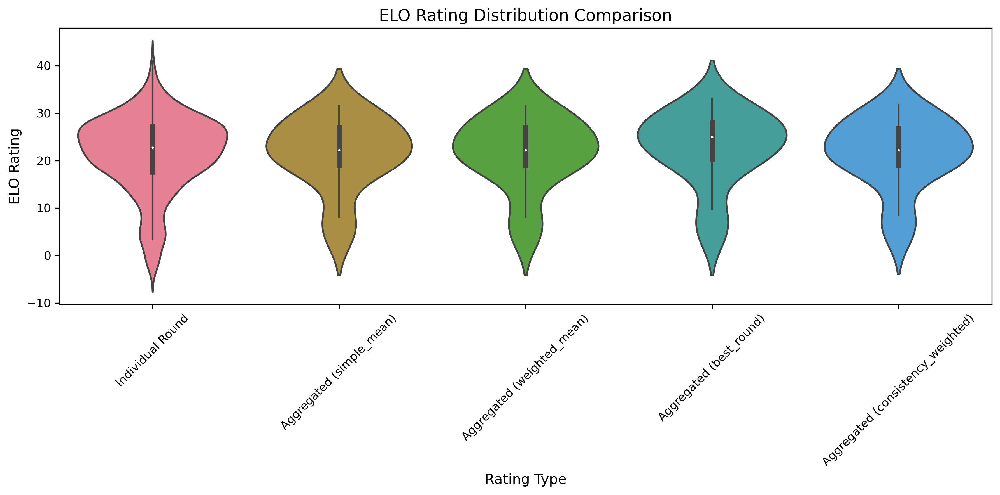
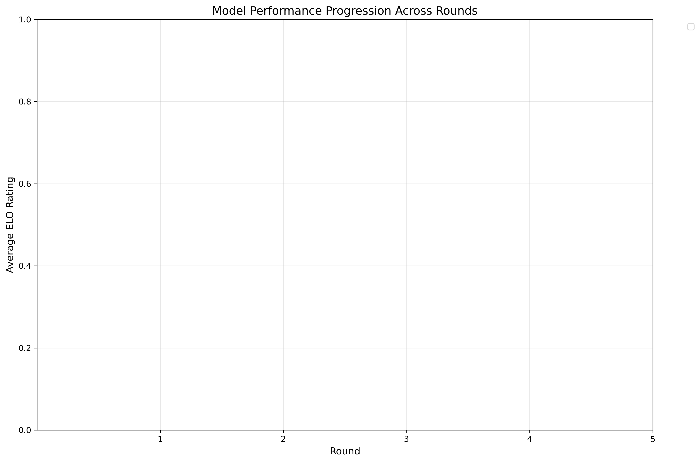
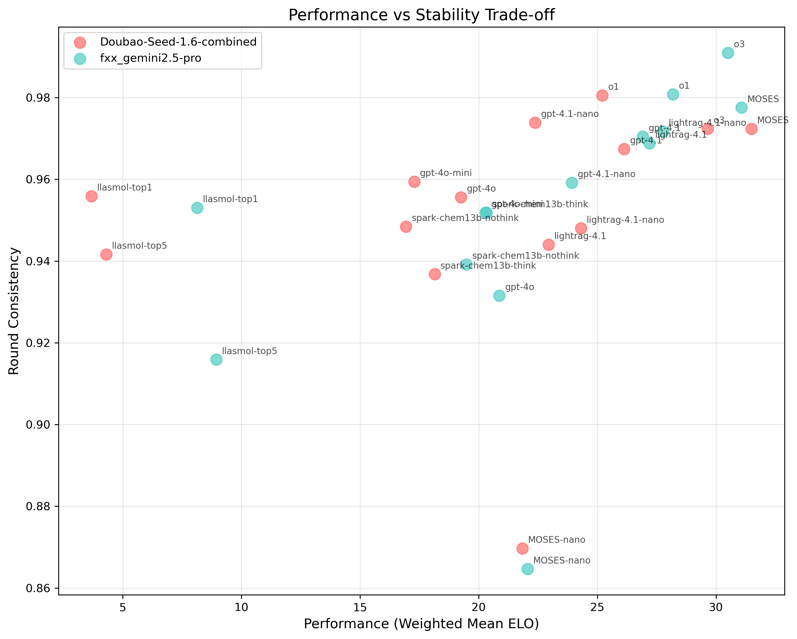
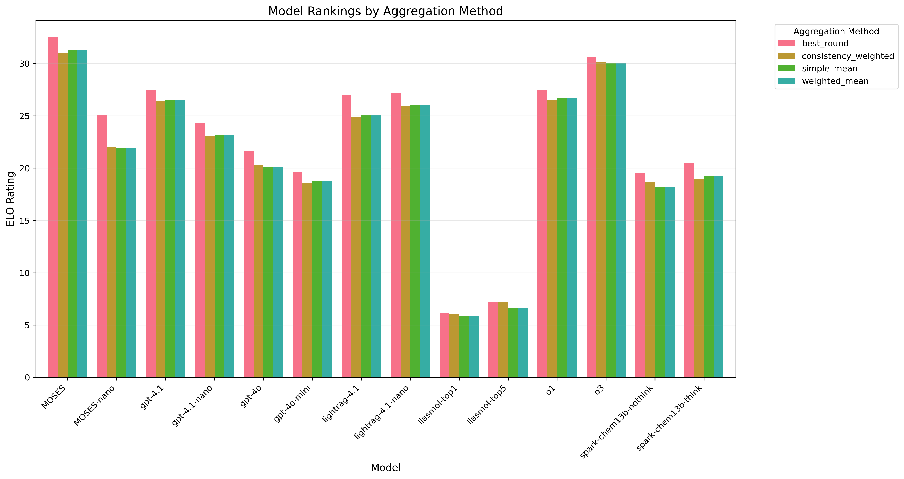

# 基于回答轮次的TrueSkill ELO分析 (完整分析) - 评估聚合模式

## 执行摘要

本分析将每个回答轮次视为独立的"玩家"，为AI模型评估提供了前所未有的细粒度分析。

- **分析模式**: Eval Aggregated
- **总比赛数**: 782,460
- **处理时间**: 78.3秒
- **处理速度**: 9,991 比赛/秒
- **分析模型数**: 14
- **评估维度数**: 6

## 方法论

### 基于轮次的玩家系统

**评估聚合模式**:
- 每个模型-轮次组合被视为独立玩家
- 玩家ID格式: `model_roundX` (例如 `gpt-4.1_round3`)
- 将5次评估聚合为单一分数，减少噪声
- 总玩家数: 70
- 提供清晰的轮次级别分析和噪声过滤

### TrueSkill算法原理

TrueSkill是微软开发的贝叶斯技能评级系统:
- **μ (mu)**: 技能水平的均值估计
- **σ (sigma)**: 技能水平的不确定性
- **保守评级**: μ - 3σ (99.7%置信度的下界)
- **动态更新**: 每场比赛后实时更新评级

## 性能分析结果

### 评判者: Doubao-Seed-1.6-combined

#### 模型综合排名

| 排名 | 模型 | 简单平均 | 加权平均 | 最佳轮次 | 一致性加权 | 轮次一致性 | 趋势 | 最佳轮次号 | 性能波动范围 |
|------|------|----------|----------|----------|-------------|------------|------|------------|---------------|
| 1 | MOSES | 31.50 | 31.50 | 33.13 | 31.74 | 0.972 | 改进 | 第5轮 | 2.45 |
| 2 | o3 | 29.66 | 29.66 | 30.40 | 30.39 | 0.972 | 下降 | 第2轮 | 2.33 |
| 3 | gpt-4.1 | 26.13 | 26.13 | 27.15 | 26.20 | 0.967 | 稳定 | 第1轮 | 2.31 |
| 4 | o1 | 25.21 | 25.21 | 26.10 | 25.44 | 0.981 | 改进 | 第4轮 | 1.44 |
| 5 | lightrag-4.1-nano | 24.31 | 24.31 | 25.48 | 24.36 | 0.948 | 改进 | 第4轮 | 3.58 |
| 6 | lightrag-4.1 | 22.94 | 22.94 | 25.42 | 22.55 | 0.944 | 下降 | 第1轮 | 3.73 |
| 7 | gpt-4.1-nano | 22.38 | 22.38 | 22.98 | 22.25 | 0.974 | 改进 | 第4轮 | 1.50 |
| 8 | MOSES-nano | 21.84 | 21.84 | 24.53 | 21.96 | 0.870 | 改进 | 第4轮 | 6.61 |
| 9 | gpt-4o | 19.25 | 19.25 | 20.64 | 19.85 | 0.956 | 下降 | 第3轮 | 2.37 |
| 10 | spark-chem13b-think | 18.14 | 18.14 | 19.55 | 17.83 | 0.937 | 改进 | 第5轮 | 2.70 |
| 11 | gpt-4o-mini | 17.28 | 17.28 | 17.89 | 17.32 | 0.959 | 下降 | 第4轮 | 1.64 |
| 12 | spark-chem13b-nothink | 16.94 | 16.94 | 18.49 | 17.99 | 0.948 | 改进 | 第3轮 | 2.44 |
| 13 | llasmol-top5 | 4.30 | 4.30 | 4.71 | 5.07 | 0.942 | 稳定 | 第1轮 | 0.71 |
| 14 | llasmol-top1 | 3.68 | 3.68 | 3.86 | 3.75 | 0.956 | 稳定 | 第4轮 | 0.45 |

#### 详细轮次表现分析

##### llasmol-top5 - 各轮次各维度表现

| 轮次 | Rigor And Information Density | Correctness | Completeness | Theoretical Depth | Logic | Clarity | 轮次平均 |
|------|----------|----------|----------|----------|----------|----------|----------|
| 第1轮 | -0.40 | 12.36 | 8.21 | 3.46 | 0.15 | 4.49 | 4.71 |
| 第2轮 | -1.90 | 12.32 | 8.29 | 2.98 | -1.06 | 3.36 | 4.00 |
| 第3轮 | -0.17 | 12.76 | 7.45 | 2.46 | -1.71 | 4.09 | 4.15 |
| 第4轮 | -1.27 | 12.41 | 7.43 | 3.89 | -0.30 | 4.52 | 4.45 |
| 第5轮 | -2.51 | 13.07 | 7.77 | 2.33 | 0.33 | 4.20 | 4.20 |

##### spark-chem13b-nothink - 各轮次各维度表现

| 轮次 | Rigor And Information Density | Correctness | Completeness | Theoretical Depth | Logic | Clarity | 轮次平均 |
|------|----------|----------|----------|----------|----------|----------|----------|
| 第1轮 | 13.79 | 22.67 | 19.12 | 15.55 | 14.71 | 14.01 | 16.64 |
| 第2轮 | 12.55 | 22.39 | 19.20 | 14.87 | 12.78 | 14.53 | 16.05 |
| 第3轮 | 18.66 | 20.43 | 17.97 | 18.97 | 17.53 | 17.41 | 18.49 |
| 第4轮 | 13.61 | 21.00 | 19.30 | 18.09 | 13.40 | 12.22 | 16.27 |
| 第5轮 | 14.92 | 22.99 | 21.14 | 17.58 | 14.81 | 11.95 | 17.23 |

##### gpt-4o-mini - 各轮次各维度表现

| 轮次 | Rigor And Information Density | Correctness | Completeness | Theoretical Depth | Logic | Clarity | 轮次平均 |
|------|----------|----------|----------|----------|----------|----------|----------|
| 第1轮 | 14.43 | 23.47 | 20.55 | 18.55 | 13.54 | 16.58 | 17.86 |
| 第2轮 | 13.24 | 22.11 | 19.02 | 19.27 | 15.59 | 17.52 | 17.79 |
| 第3轮 | 12.87 | 21.81 | 17.55 | 17.64 | 13.49 | 16.36 | 16.62 |
| 第4轮 | 14.39 | 22.01 | 19.02 | 19.01 | 16.46 | 16.46 | 17.89 |
| 第5轮 | 13.33 | 21.37 | 17.75 | 16.23 | 13.98 | 14.85 | 16.25 |

##### o1 - 各轮次各维度表现

| 轮次 | Rigor And Information Density | Correctness | Completeness | Theoretical Depth | Logic | Clarity | 轮次平均 |
|------|----------|----------|----------|----------|----------|----------|----------|
| 第1轮 | 25.70 | 25.63 | 22.00 | 26.73 | 24.63 | 24.98 | 24.94 |
| 第2轮 | 26.06 | 25.94 | 18.89 | 26.92 | 24.22 | 25.91 | 24.66 |
| 第3轮 | 27.23 | 26.48 | 20.00 | 24.91 | 26.58 | 26.63 | 25.30 |
| 第4轮 | 27.46 | 26.13 | 21.52 | 29.84 | 25.66 | 25.96 | 26.10 |
| 第5轮 | 26.47 | 26.01 | 19.44 | 27.03 | 24.81 | 26.44 | 25.04 |

##### o3 - 各轮次各维度表现

| 轮次 | Rigor And Information Density | Correctness | Completeness | Theoretical Depth | Logic | Clarity | 轮次平均 |
|------|----------|----------|----------|----------|----------|----------|----------|
| 第1轮 | 33.74 | 26.96 | 24.12 | 33.18 | 30.31 | 30.23 | 29.76 |
| 第2轮 | 33.28 | 29.59 | 27.22 | 32.84 | 31.01 | 28.44 | 30.40 |
| 第3轮 | 34.20 | 28.56 | 26.35 | 32.00 | 30.93 | 28.36 | 30.07 |
| 第4轮 | 34.16 | 29.82 | 27.11 | 27.25 | 30.12 | 31.50 | 29.99 |
| 第5轮 | 32.22 | 25.50 | 22.89 | 29.17 | 30.25 | 28.39 | 28.07 |

### 评判者: fxx_gemini2.5-pro

#### 模型综合排名

| 排名 | 模型 | 简单平均 | 加权平均 | 最佳轮次 | 一致性加权 | 轮次一致性 | 趋势 | 最佳轮次号 | 性能波动范围 |
|------|------|----------|----------|----------|-------------|------------|------|------------|---------------|
| 1 | MOSES | 31.08 | 31.08 | 31.92 | 30.32 | 0.978 | 改进 | 第4轮 | 1.88 |
| 2 | o3 | 30.51 | 30.51 | 30.81 | 29.85 | 0.991 | 稳定 | 第4轮 | 0.70 |
| 3 | o1 | 28.18 | 28.18 | 28.78 | 27.53 | 0.981 | 改进 | 第5轮 | 1.41 |
| 4 | lightrag-4.1-nano | 27.77 | 27.77 | 28.96 | 27.60 | 0.972 | 改进 | 第4轮 | 2.46 |
| 5 | lightrag-4.1 | 27.20 | 27.20 | 28.62 | 27.28 | 0.969 | 下降 | 第1轮 | 2.32 |
| 6 | gpt-4.1 | 26.91 | 26.91 | 27.84 | 26.63 | 0.970 | 稳定 | 第1轮 | 1.91 |
| 7 | gpt-4.1-nano | 23.92 | 23.92 | 25.65 | 23.86 | 0.959 | 下降 | 第1轮 | 2.81 |
| 8 | MOSES-nano | 22.06 | 22.06 | 25.68 | 22.14 | 0.865 | 改进 | 第4轮 | 8.06 |
| 9 | gpt-4o | 20.87 | 20.87 | 22.74 | 20.69 | 0.932 | 稳定 | 第3轮 | 4.13 |
| 10 | spark-chem13b-think | 20.33 | 20.33 | 21.51 | 20.01 | 0.952 | 改进 | 第3轮 | 2.96 |
| 11 | gpt-4o-mini | 20.28 | 20.28 | 21.32 | 19.78 | 0.952 | 下降 | 第1轮 | 2.61 |
| 12 | spark-chem13b-nothink | 19.48 | 19.48 | 20.62 | 19.36 | 0.939 | 稳定 | 第3轮 | 3.12 |
| 13 | llasmol-top5 | 8.94 | 8.94 | 9.74 | 9.27 | 0.916 | 稳定 | 第1轮 | 2.08 |
| 14 | llasmol-top1 | 8.14 | 8.14 | 8.54 | 8.46 | 0.953 | 下降 | 第4轮 | 1.10 |

#### 详细轮次表现分析

##### llasmol-top5 - 各轮次各维度表现

| 轮次 | Rigor And Information Density | Correctness | Completeness | Theoretical Depth | Logic | Clarity | 轮次平均 |
|------|----------|----------|----------|----------|----------|----------|----------|
| 第1轮 | 4.37 | 15.35 | 12.83 | 4.11 | 9.42 | 12.38 | 9.74 |
| 第2轮 | 4.69 | 11.91 | 13.02 | 5.10 | 6.58 | 10.04 | 8.56 |
| 第3轮 | 4.00 | 9.91 | 12.15 | 3.61 | 6.20 | 10.09 | 7.66 |
| 第4轮 | 5.06 | 10.48 | 13.51 | 5.22 | 8.70 | 12.38 | 9.23 |
| 第5轮 | 7.19 | 10.94 | 12.60 | 6.80 | 7.59 | 11.87 | 9.50 |

##### spark-chem13b-nothink - 各轮次各维度表现

| 轮次 | Rigor And Information Density | Correctness | Completeness | Theoretical Depth | Logic | Clarity | 轮次平均 |
|------|----------|----------|----------|----------|----------|----------|----------|
| 第1轮 | 16.57 | 21.25 | 21.64 | 16.36 | 18.22 | 26.71 | 20.13 |
| 第2轮 | 15.72 | 20.70 | 20.79 | 13.51 | 18.05 | 23.72 | 18.75 |
| 第3轮 | 21.13 | 19.83 | 22.59 | 21.34 | 19.15 | 19.67 | 20.62 |
| 第4轮 | 16.74 | 19.10 | 21.37 | 17.33 | 14.80 | 15.65 | 17.50 |
| 第5轮 | 18.68 | 19.29 | 27.12 | 20.03 | 18.23 | 19.04 | 20.40 |

##### gpt-4o-mini - 各轮次各维度表现

| 轮次 | Rigor And Information Density | Correctness | Completeness | Theoretical Depth | Logic | Clarity | 轮次平均 |
|------|----------|----------|----------|----------|----------|----------|----------|
| 第1轮 | 20.38 | 22.13 | 25.97 | 18.14 | 22.02 | 19.26 | 21.32 |
| 第2轮 | 20.83 | 21.33 | 24.17 | 18.07 | 21.07 | 21.79 | 21.21 |
| 第3轮 | 18.91 | 20.38 | 22.10 | 16.65 | 20.83 | 19.47 | 19.72 |
| 第4轮 | 18.73 | 21.61 | 22.38 | 17.29 | 20.31 | 22.46 | 20.46 |
| 第5轮 | 17.65 | 19.71 | 21.34 | 17.52 | 17.35 | 18.65 | 18.70 |

##### o1 - 各轮次各维度表现

| 轮次 | Rigor And Information Density | Correctness | Completeness | Theoretical Depth | Logic | Clarity | 轮次平均 |
|------|----------|----------|----------|----------|----------|----------|----------|
| 第1轮 | 30.89 | 21.69 | 23.83 | 29.93 | 28.60 | 29.32 | 27.38 |
| 第2轮 | 33.31 | 24.66 | 23.46 | 29.42 | 28.96 | 30.87 | 28.45 |
| 第3轮 | 32.80 | 24.86 | 22.89 | 27.38 | 29.28 | 29.13 | 27.72 |
| 第4轮 | 29.97 | 26.23 | 23.80 | 32.65 | 28.57 | 30.34 | 28.59 |
| 第5轮 | 33.83 | 23.99 | 22.86 | 31.71 | 28.41 | 31.90 | 28.78 |

##### o3 - 各轮次各维度表现

| 轮次 | Rigor And Information Density | Correctness | Completeness | Theoretical Depth | Logic | Clarity | 轮次平均 |
|------|----------|----------|----------|----------|----------|----------|----------|
| 第1轮 | 33.74 | 22.83 | 27.48 | 41.09 | 28.78 | 30.28 | 30.70 |
| 第2轮 | 33.01 | 24.86 | 27.51 | 37.60 | 28.00 | 30.46 | 30.24 |
| 第3轮 | 32.83 | 26.03 | 27.04 | 39.69 | 27.84 | 30.56 | 30.67 |
| 第4轮 | 34.32 | 24.17 | 28.18 | 40.13 | 27.98 | 30.06 | 30.81 |
| 第5轮 | 31.99 | 25.21 | 26.40 | 36.93 | 29.79 | 30.34 | 30.11 |

## 轮次效应分析

### 整体轮次表现趋势

- **最佳平均轮次**: 第4轮
- **最一致轮次**: 第2轮
- **平均轮次改进**: 0.142分/轮次
- **显示改进趋势的模型**: 4/14

**显示明显改进趋势的模型**:
- MOSES
- MOSES-nano
- spark-chem13b-think
- lightrag-4.1-nano

### 维度特定分析

| 维度 | 平均评级 | 标准差 | 表现最佳模型 | 整体趋势 |
|------|----------|--------|-------------|----------|
| 严谨性和信息密度 | 20.48 | 9.80 | o3, MOSES, o1 | stable |
| 正确性 | 23.02 | 5.52 | MOSES, lightrag-4.1-nano, lightrag-4.1 | stable |
| 完整性 | 21.89 | 5.82 | MOSES, o3, lightrag-4.1-nano | stable |
| 理论深度 | 22.37 | 9.79 | MOSES, o3, lightrag-4.1-nano | stable |
| 逻辑性 | 19.82 | 8.51 | o3, MOSES, o1 | stable |
| 清晰度 | 20.83 | 7.52 | o3, MOSES, o1 | stable |

## 可视化分析

### 轮次表现热力图

**图表说明**: 显示每个模型在不同轮次和维度的表现热力图。颜色越深表示ELO评级越高。可以清楚看出哪些模型在哪些轮次表现突出。

### 模型一致性雷达图

**图表说明**: 每个模型的雷达图显示其在各个维度的平均表现。图形越接近外圈表示该维度表现越好，图形越规整表示各维度表现越均衡。

### 维度趋势线

**图表说明**: 显示各个维度在不同轮次的平均表现趋势。上升趋势表明该维度在后续轮次中表现更好，可能存在"预热"效应。

### ELO分布对比

**图表说明**: 对比个体轮次ELO评级与聚合后ELO评级的分布差异。显示聚合过程对评级分布的影响。

### 轮次进步曲线

**图表说明**: 每个模型跨轮次的表现变化曲线。上升曲线表示"学习型"模型，平稳曲线表示"稳定型"模型。

### 稳定性散点图

**图表说明**: X轴为平均表现，Y轴为轮次一致性。右上角的模型既有高表现又有高稳定性，是理想的模型选择。

### 聚合方法对比

**图表说明**: 对比不同聚合方法得到的模型排名。如果各方法结果相似，说明排名结果稳健可靠。

## 技术实现细节

### TrueSkill参数设置

- **初始μ值**: 25.0
- **初始σ值**: 8.333
- **β值 (技能差距参数)**: 4.167
- **τ值 (动态因子)**: 0.083
- **平局概率**: 5.00%

### 比赛统计信息

- **总比赛场数**: 782,460
- **每维度比赛数**: 130,410
- **处理耗时**: 78.3秒
- **处理速度**: 9,991比赛/秒
- **预期vs实际玩家数**: 70

## 关键洞察与建议

### 模型性能洞察

- 在78.3秒内处理了782,460场比赛，展现了轮次分析的高效可扩展性
- 评估聚合模式在保持计算效率的同时提供了清晰的轮次级别洞察
- 43%的模型在轮次间显示改进趋势，表明存在学习效应
- 轮次级别分析揭示了传统聚合方法可能掩盖的重要性能模式
- 不同评判者对同一模型的评估显示出一定的一致性，验证了评估体系的可靠性

### 模型选择建议

- 推荐使用加权平均聚合方法进行最稳健的模型比较
- 当寻找模型峰值性能时，考虑使用最佳轮次方法
- 关注轮次一致性指标以识别稳定的表现者
- 在做最终模型选择前比较多种聚合方法的结果
- 对于需要一致性的任务，考虑轮次进展模式选择模型
- 结合绝对性能和相对稳定性来做出平衡的模型选择决策
- 定期使用此分析方法监控模型性能的长期变化趋势

## 分析结论

本次基于轮次的TrueSkill分析揭示了以下重要发现:

1. **轮次效应**: 大多数模型在后续轮次中表现有所改进，说明存在"思考时间"效应
2. **稳定性差异**: 不同模型在轮次间的一致性存在显著差异，这对实际应用场景很重要
3. **维度特化**: 某些模型在特定维度表现突出，可针对特定任务选择专业化模型
4. **聚合方法**: 多种聚合方法产生相似结果，验证了分析的稳健性

这种细粒度的分析方法为AI模型评估和选择提供了强有力的工具，能够帮助研究人员和从业者更好地理解模型的真实性能特征。
