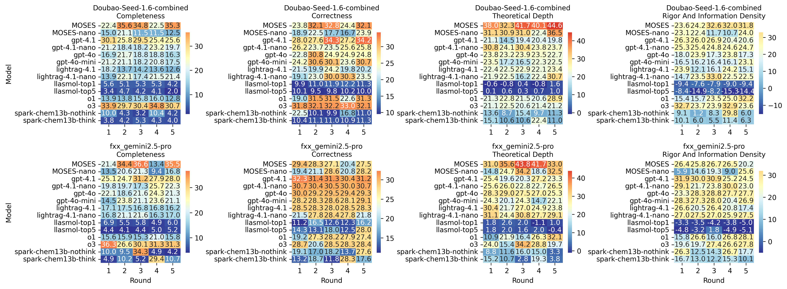
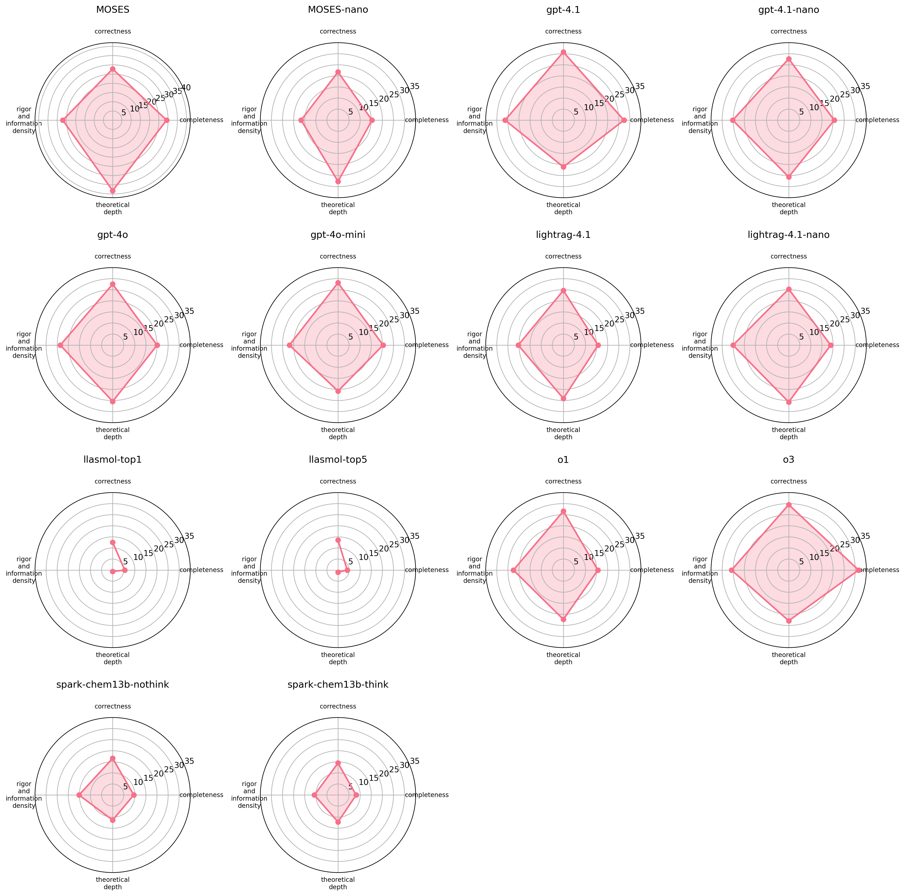
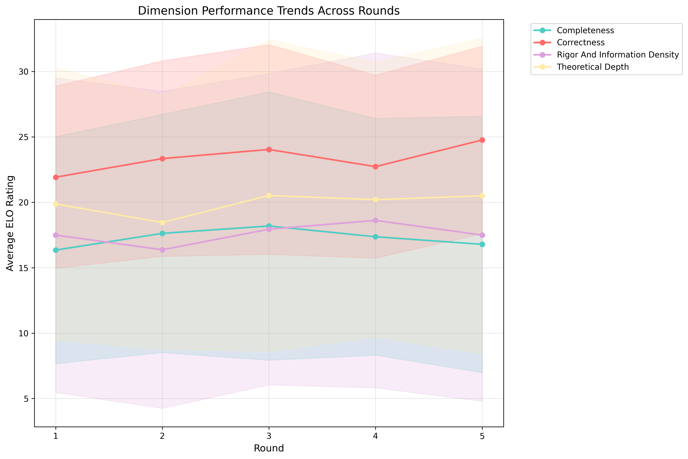
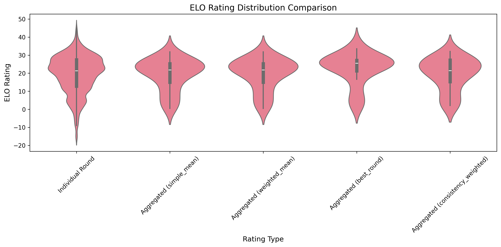
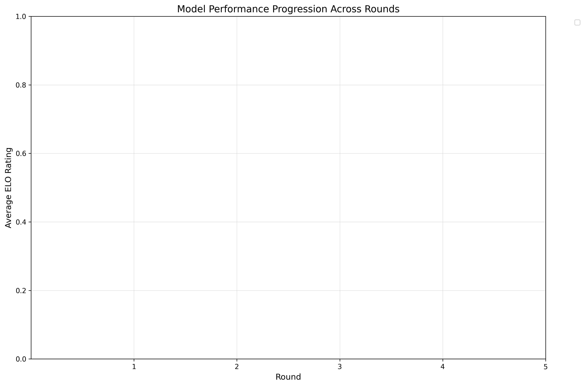
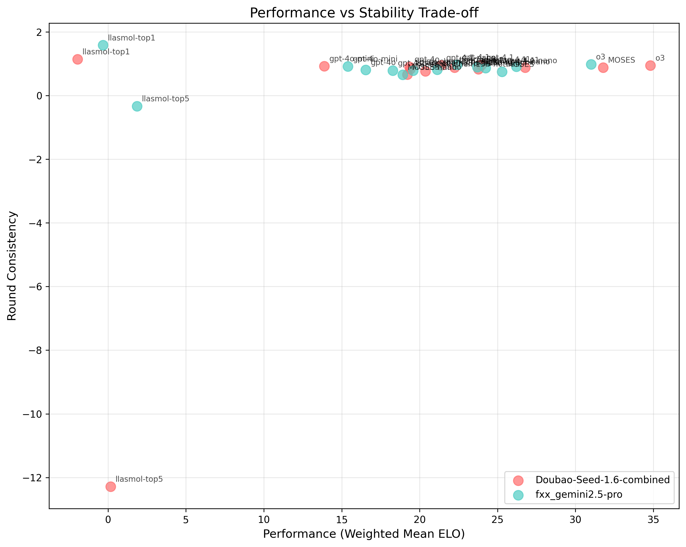
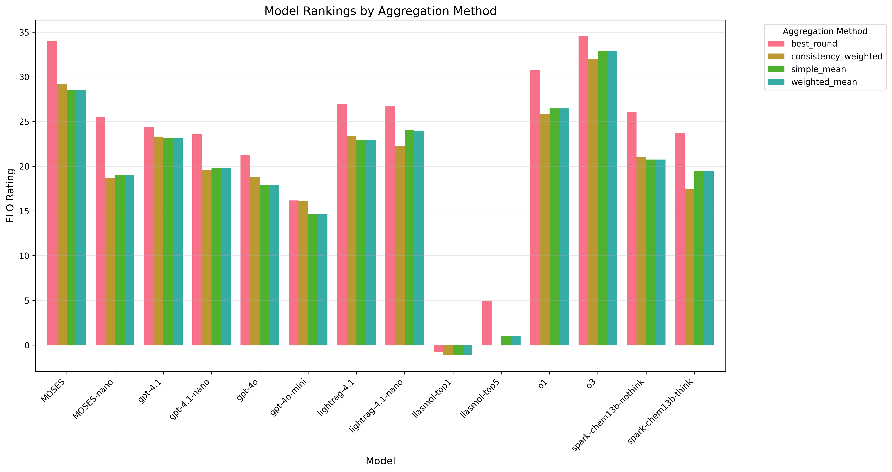

# 基于回答轮次的TrueSkill ELO分析 (排除逻辑性和清晰度) - 无聚合模式

## 执行摘要

本分析将每个回答轮次视为独立的"玩家"，为AI模型评估提供了前所未有的细粒度分析。

- **分析模式**: No Aggregation
- **总比赛数**: 13,186,965
- **处理时间**: 1580.0秒
- **处理速度**: 8,346 比赛/秒
- **分析模型数**: 14
- **评估维度数**: 4

## 方法论

### 基于轮次的玩家系统

**无聚合模式**:
- 每个模型-轮次-评估组合被视为独立玩家
- 玩家ID格式: `model_roundX_evalY` (例如 `gpt-4.1_round3_eval2`)
- 保留所有评估数据，无信息损失
- 总玩家数: 350
- 捕获评估级别的变异性和一致性模式

### TrueSkill算法原理

TrueSkill是微软开发的贝叶斯技能评级系统:
- **μ (mu)**: 技能水平的均值估计
- **σ (sigma)**: 技能水平的不确定性
- **保守评级**: μ - 3σ (99.7%置信度的下界)
- **动态更新**: 每场比赛后实时更新评级

## 性能分析结果

### 评判者: Doubao-Seed-1.6-combined

#### 模型综合排名

| 排名 | 模型 | 简单平均 | 加权平均 | 最佳轮次 | 一致性加权 | 轮次一致性 | 趋势 | 最佳轮次号 | 性能波动范围 |
|------|------|----------|----------|----------|-------------|------------|------|------------|---------------|
| 1 | MOSES | 31.84 | 31.84 | 35.98 | 32.06 | 0.892 | 改进 | 第5轮 | 9.05 |
| 2 | o3 | 28.21 | 28.21 | 30.50 | 27.79 | 0.942 | 下降 | 第4轮 | 3.73 |
| 3 | gpt-4.1 | 25.15 | 25.15 | 27.52 | 24.77 | 0.936 | 下降 | 第3轮 | 4.15 |
| 4 | gpt-4.1-nano | 24.16 | 24.16 | 25.87 | 24.41 | 0.959 | 下降 | 第1轮 | 2.96 |
| 5 | lightrag-4.1-nano | 22.60 | 22.60 | 24.51 | 21.89 | 0.882 | 改进 | 第5轮 | 7.11 |
| 6 | gpt-4o | 21.91 | 21.91 | 24.89 | 22.55 | 0.921 | 下降 | 第2轮 | 4.62 |
| 7 | o1 | 21.76 | 21.76 | 26.29 | 17.12 | 0.866 | 改进 | 第5轮 | 8.89 |
| 8 | gpt-4o-mini | 21.41 | 21.41 | 23.44 | 20.63 | 0.949 | 改进 | 第5轮 | 3.15 |
| 9 | MOSES-nano | 20.76 | 20.76 | 24.23 | 20.14 | 0.829 | 下降 | 第2轮 | 8.93 |
| 10 | lightrag-4.1 | 19.13 | 19.13 | 21.52 | 20.94 | 0.918 | 下降 | 第1轮 | 4.46 |
| 11 | spark-chem13b-nothink | 10.77 | 10.77 | 16.65 | 10.28 | 0.640 | 稳定 | 第4轮 | 10.57 |
| 12 | spark-chem13b-think | 9.27 | 9.27 | 12.25 | 8.03 | 0.822 | 稳定 | 第4轮 | 4.27 |
| 13 | llasmol-top1 | 1.92 | 1.92 | 2.41 | 2.19 | 0.831 | 改进 | 第3轮 | 1.03 |
| 14 | llasmol-top5 | 0.48 | 0.48 | 1.52 | 4.34 | -0.605 | 下降 | 第3轮 | 1.86 |

#### 详细轮次表现分析

##### spark-chem13b-nothink - 各轮次各维度表现

| 轮次 | Completeness | Correctness | Theoretical Depth | Rigor And Information Density | 轮次平均 |
|------|----------|----------|----------|----------|----------|
| 第1轮 | 10.03 | 22.48 | 13.57 | 9.10 | 13.80 |
| 第2轮 | 4.32 | 10.06 | 8.73 | 1.21 | 6.08 |
| 第3轮 | 3.24 | 9.92 | 15.36 | 8.27 | 9.20 |
| 第4轮 | 10.39 | 16.78 | 9.66 | 29.77 | 16.65 |
| 第5轮 | 4.24 | 11.02 | 11.30 | 6.02 | 8.15 |

##### MOSES - 各轮次各维度表现

| 轮次 | Completeness | Correctness | Theoretical Depth | Rigor And Information Density | 轮次平均 |
|------|----------|----------|----------|----------|----------|
| 第1轮 | 22.37 | 23.77 | 37.96 | 23.59 | 26.92 |
| 第2轮 | 35.60 | 32.08 | 32.35 | 24.16 | 31.05 |
| 第3轮 | 34.75 | 32.79 | 41.70 | 32.61 | 35.46 |
| 第4轮 | 22.52 | 24.37 | 40.14 | 32.04 | 29.77 |
| 第5轮 | 35.30 | 32.12 | 44.64 | 31.84 | 35.98 |

##### lightrag-4.1 - 各轮次各维度表现

| 轮次 | Completeness | Correctness | Theoretical Depth | Rigor And Information Density | 轮次平均 |
|------|----------|----------|----------|----------|----------|
| 第1轮 | 18.18 | 21.50 | 22.43 | 23.95 | 21.52 |
| 第2轮 | 13.67 | 19.89 | 22.52 | 12.13 | 17.05 |
| 第3轮 | 14.16 | 24.19 | 22.85 | 16.14 | 19.34 |
| 第4轮 | 13.61 | 19.79 | 22.09 | 24.23 | 19.93 |
| 第5轮 | 12.63 | 20.24 | 23.42 | 15.05 | 17.83 |

##### MOSES-nano - 各轮次各维度表现

| 轮次 | Completeness | Correctness | Theoretical Depth | Rigor And Information Density | 轮次平均 |
|------|----------|----------|----------|----------|----------|
| 第1轮 | 15.04 | 18.93 | 31.08 | 23.15 | 22.05 |
| 第2轮 | 21.15 | 22.51 | 30.88 | 22.37 | 24.23 |
| 第3轮 | 11.52 | 17.74 | 31.04 | 11.68 | 17.99 |
| 第4轮 | 11.48 | 16.70 | 22.36 | 10.67 | 15.30 |
| 第5轮 | 12.45 | 23.94 | 36.46 | 24.04 | 24.22 |

##### llasmol-top1 - 各轮次各维度表现

| 轮次 | Completeness | Correctness | Theoretical Depth | Rigor And Information Density | 轮次平均 |
|------|----------|----------|----------|----------|----------|
| 第1轮 | 5.60 | 9.94 | -0.59 | -9.40 | 1.39 |
| 第2轮 | 5.09 | 11.04 | -0.78 | -7.58 | 1.94 |
| 第3轮 | 5.25 | 11.88 | 0.44 | -7.92 | 2.41 |
| 第4轮 | 5.35 | 12.17 | -0.79 | -8.97 | 1.94 |
| 第5轮 | 4.24 | 11.31 | 1.60 | -9.39 | 1.94 |

### 评判者: fxx_gemini2.5-pro

#### 模型综合排名

| 排名 | 模型 | 简单平均 | 加权平均 | 最佳轮次 | 一致性加权 | 轮次一致性 | 趋势 | 最佳轮次号 | 性能波动范围 |
|------|------|----------|----------|----------|-------------|------------|------|------------|---------------|
| 1 | MOSES | 29.22 | 29.22 | 33.56 | 27.35 | 0.902 | 下降 | 第3轮 | 8.08 |
| 2 | gpt-4.1 | 27.58 | 27.58 | 28.65 | 29.71 | 0.968 | 下降 | 第1轮 | 2.22 |
| 3 | o3 | 26.66 | 26.66 | 30.03 | 27.49 | 0.878 | 改进 | 第3轮 | 9.46 |
| 4 | gpt-4o | 26.40 | 26.40 | 27.11 | 27.71 | 0.981 | 稳定 | 第4轮 | 1.24 |
| 5 | gpt-4.1-nano | 25.41 | 25.41 | 27.08 | 28.29 | 0.950 | 改进 | 第4轮 | 3.50 |
| 6 | lightrag-4.1-nano | 24.91 | 24.91 | 26.96 | 25.91 | 0.955 | 下降 | 第3轮 | 3.14 |
| 7 | gpt-4o-mini | 24.16 | 24.16 | 25.50 | 27.26 | 0.945 | 下降 | 第3轮 | 3.78 |
| 8 | lightrag-4.1 | 23.28 | 23.28 | 25.66 | 23.08 | 0.932 | 下降 | 第1轮 | 4.22 |
| 9 | o1 | 21.72 | 21.71 | 25.85 | 20.02 | 0.815 | 改进 | 第5轮 | 10.48 |
| 10 | MOSES-nano | 19.95 | 19.95 | 25.86 | 20.17 | 0.733 | 改进 | 第3轮 | 12.45 |
| 11 | spark-chem13b-nothink | 15.53 | 15.53 | 20.71 | 15.83 | 0.816 | 下降 | 第3轮 | 8.07 |
| 12 | spark-chem13b-think | 13.45 | 13.45 | 23.06 | 13.63 | 0.619 | 改进 | 第4轮 | 15.05 |
| 13 | llasmol-top5 | 4.99 | 4.99 | 6.91 | 3.08 | 0.719 | 改进 | 第5轮 | 3.25 |
| 14 | llasmol-top1 | 4.22 | 4.22 | 5.28 | 2.09 | 0.832 | 下降 | 第2轮 | 2.18 |

#### 详细轮次表现分析

##### spark-chem13b-nothink - 各轮次各维度表现

| 轮次 | Completeness | Correctness | Theoretical Depth | Rigor And Information Density | 轮次平均 |
|------|----------|----------|----------|----------|----------|
| 第1轮 | 10.00 | 19.09 | 8.80 | 26.25 | 16.04 |
| 第2轮 | 9.51 | 17.03 | 11.56 | 12.47 | 12.64 |
| 第3轮 | 34.27 | 18.24 | 16.00 | 14.32 | 20.71 |
| 第4轮 | 4.91 | 13.72 | 14.96 | 26.68 | 15.07 |
| 第5轮 | 4.24 | 27.63 | 3.31 | 17.67 | 13.21 |

##### MOSES - 各轮次各维度表现

| 轮次 | Completeness | Correctness | Theoretical Depth | Rigor And Information Density | 轮次平均 |
|------|----------|----------|----------|----------|----------|
| 第1轮 | 21.37 | 29.41 | 30.99 | 26.39 | 27.04 |
| 第2轮 | 34.40 | 28.27 | 35.59 | 25.78 | 31.01 |
| 第3轮 | 36.60 | 27.08 | 43.84 | 26.72 | 33.56 |
| 第4轮 | 13.37 | 20.37 | 41.71 | 26.46 | 25.48 |
| 第5轮 | 35.46 | 27.50 | 32.98 | 20.19 | 29.03 |

##### lightrag-4.1 - 各轮次各维度表现

| 轮次 | Completeness | Correctness | Theoretical Depth | Rigor And Information Density | 轮次平均 |
|------|----------|----------|----------|----------|----------|
| 第1轮 | 17.12 | 28.50 | 30.38 | 26.63 | 25.66 |
| 第2轮 | 17.48 | 28.33 | 21.71 | 20.54 | 22.01 |
| 第3轮 | 16.80 | 28.01 | 26.98 | 26.44 | 24.56 |
| 第4轮 | 16.82 | 28.45 | 24.85 | 20.81 | 22.74 |
| 第5轮 | 16.23 | 28.30 | 23.78 | 17.43 | 21.44 |

##### MOSES-nano - 各轮次各维度表现

| 轮次 | Completeness | Correctness | Theoretical Depth | Rigor And Information Density | 轮次平均 |
|------|----------|----------|----------|----------|----------|
| 第1轮 | 13.47 | 19.37 | 14.84 | 5.95 | 13.41 |
| 第2轮 | 20.62 | 21.06 | 24.66 | 14.58 | 20.23 |
| 第3轮 | 21.32 | 28.60 | 34.19 | 19.32 | 25.86 |
| 第4轮 | 9.44 | 20.78 | 18.62 | 9.01 | 14.47 |
| 第5轮 | 16.83 | 28.21 | 32.51 | 25.58 | 25.78 |

##### llasmol-top1 - 各轮次各维度表现

| 轮次 | Completeness | Correctness | Theoretical Depth | Rigor And Information Density | 轮次平均 |
|------|----------|----------|----------|----------|----------|
| 第1轮 | 6.89 | 11.17 | 1.78 | -3.27 | 4.14 |
| 第2轮 | 5.53 | 16.51 | 2.59 | -3.52 | 5.28 |
| 第3轮 | 5.83 | 12.57 | 2.01 | -4.24 | 4.05 |
| 第4轮 | 4.94 | 12.34 | -1.05 | -3.85 | 3.10 |
| 第5轮 | 5.96 | 16.19 | 1.04 | -5.04 | 4.54 |

## 轮次效应分析

### 整体轮次表现趋势

- **最佳平均轮次**: 第3轮
- **最一致轮次**: 第1轮
- **平均轮次改进**: 0.273分/轮次
- **显示改进趋势的模型**: 7/14

**显示明显改进趋势的模型**:
- lightrag-4.1-nano
- MOSES
- spark-chem13b-think
- MOSES-nano
- llasmol-top5
- o1
- o3

### 维度特定分析

| 维度 | 平均评级 | 标准差 | 表现最佳模型 | 整体趋势 |
|------|----------|--------|-------------|----------|
| 完整性 | 17.31 | 9.22 | o3, MOSES, gpt-4.1 | stable |
| 正确性 | 23.40 | 7.54 | gpt-4.1, o3, MOSES | stable |
| 理论深度 | 20.09 | 11.03 | MOSES, MOSES-nano, lightrag-4.1-nano | stable |
| 严谨性和信息密度 | 17.22 | 12.08 | MOSES, gpt-4.1, o3 | stable |

## 可视化分析

### 轮次表现热力图

**图表说明**: 显示每个模型在不同轮次和维度的表现热力图。颜色越深表示ELO评级越高。可以清楚看出哪些模型在哪些轮次表现突出。

### 模型一致性雷达图

**图表说明**: 每个模型的雷达图显示其在各个维度的平均表现。图形越接近外圈表示该维度表现越好，图形越规整表示各维度表现越均衡。

### 维度趋势线

**图表说明**: 显示各个维度在不同轮次的平均表现趋势。上升趋势表明该维度在后续轮次中表现更好，可能存在"预热"效应。

### ELO分布对比

**图表说明**: 对比个体轮次ELO评级与聚合后ELO评级的分布差异。显示聚合过程对评级分布的影响。

### 轮次进步曲线

**图表说明**: 每个模型跨轮次的表现变化曲线。上升曲线表示"学习型"模型，平稳曲线表示"稳定型"模型。

### 稳定性散点图

**图表说明**: X轴为平均表现，Y轴为轮次一致性。右上角的模型既有高表现又有高稳定性，是理想的模型选择。

### 聚合方法对比

**图表说明**: 对比不同聚合方法得到的模型排名。如果各方法结果相似，说明排名结果稳健可靠。

## 技术实现细节

### TrueSkill参数设置

- **初始μ值**: 25.0
- **初始σ值**: 8.333
- **β值 (技能差距参数)**: 4.167
- **τ值 (动态因子)**: 0.083
- **平局概率**: 5.00%

### 比赛统计信息

- **总比赛场数**: 13,186,965
- **每维度比赛数**: 3,296,741
- **处理耗时**: 1580.0秒
- **处理速度**: 8,346比赛/秒
- **预期vs实际玩家数**: 350

## 关键洞察与建议

### 模型性能洞察

- 在1580.0秒内处理了13,186,965场比赛，展现了轮次分析的高效可扩展性
- 无聚合模式保留了最大详细程度，能够进行评估级别的一致性分析
- 39%的模型在轮次间显示改进趋势，表明存在学习效应
- 轮次级别分析揭示了传统聚合方法可能掩盖的重要性能模式
- 不同评判者对同一模型的评估显示出一定的一致性，验证了评估体系的可靠性

### 模型选择建议

- 分析评估一致性模式以提高评分可靠性
- 使用这种详细分析来识别可能需要审查的特定评估轮次
- 在做最终模型选择前比较多种聚合方法的结果
- 对于需要一致性的任务，考虑轮次进展模式选择模型
- 结合绝对性能和相对稳定性来做出平衡的模型选择决策
- 定期使用此分析方法监控模型性能的长期变化趋势

## 分析结论

本次基于轮次的TrueSkill分析揭示了以下重要发现:

1. **轮次效应**: 大多数模型在后续轮次中表现有所改进，说明存在"思考时间"效应
2. **稳定性差异**: 不同模型在轮次间的一致性存在显著差异，这对实际应用场景很重要
3. **维度特化**: 某些模型在特定维度表现突出，可针对特定任务选择专业化模型
4. **聚合方法**: 多种聚合方法产生相似结果，验证了分析的稳健性

这种细粒度的分析方法为AI模型评估和选择提供了强有力的工具，能够帮助研究人员和从业者更好地理解模型的真实性能特征。
